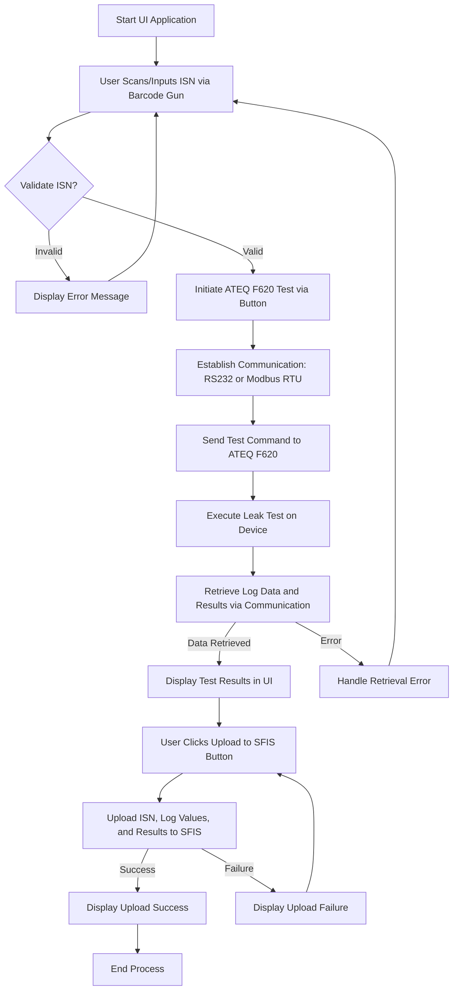

設備商相關使用手冊

* [ATEQ_F620簡易手冊](https://github.com/user-attachments/files/22941875/ATEQ_F620.pdf)
  * [All_Fct_FS6th_Uk1.08.pdf](https://github.com/user-attachments/files/22994624/All_Fct_FS6th_Uk1.08.pdf)
  * [FG_F6_MODBUS_EN_01_200617.pdf](https://github.com/user-attachments/files/23012009/FG_F6_MODBUS_EN_01_200617.pdf)
* [鐵木真科技-恒溫水槽風冷](https://github.com/user-attachments/files/22941841/-._250208.pdf)
* [氮氣填充機使用手冊](https://github.com/user-attachments/files/22941878/Vacuum.Nitrogen.Charging.System_Cooler.Master_User.Manual_v1.00.1.pdf)

####  Next Steps 
- Implement ISN validation logic specific to your requirements.
- Add Modbus RTU code for ATEQ F620 (e.g., using NModbus to send commands like 0x05 to address 0x0001 for starting a cycle).
- Define protocols for water bath and N₂ filler (e.g., ASCII commands over RS-232).
- Implement SFIS upload (e.g., HTTP client or SQL connection).
- Add error handling for RS-232 communication and log saving (e.g., to CSV).

This layout aligns with the workflow, integrates barcode scanning, and supports SFIS upload while remaining intuitive for non-programmers. If you need specific code for Modbus RTU, SFIS integration, or device-specific protocols, please provide more details (e.g., water bath/N₂ filler command formats or SFIS API specs).

請參考以下control logic:

ISN 條碼：代表工件的唯一識別碼，通常由作業員以條碼槍刷入。

ATEQ F620 通訊：你可以選擇 RS232 或 Modbus RTU，建議封裝通訊模組以便日後切換。

測試結果解析：F620 回傳的 log 通常包含壓力值、洩漏率、測試狀態（PASS/FAIL），需解析並顯示。

SFIS 上傳：建議使用 REST API 或 FTP 等方式與 SFIS 系統對接，並記錄上傳狀態。

